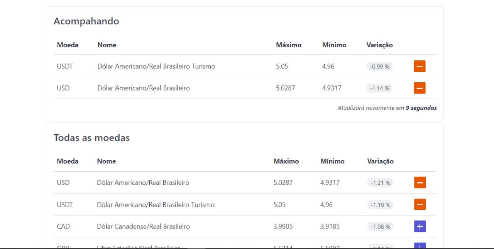

<h1 align="center">
  Cripto Currency
</h1>

<p align="center">
  <a href="#-projeto">Projeto</a>&nbsp;&nbsp;&nbsp;|&nbsp;&nbsp;&nbsp;
  <a href="#-tecnologias-utilizadas">Tecnologias Utilizadas</a>&nbsp;&nbsp;&nbsp;|&nbsp;&nbsp;&nbsp;
  <a href="#-como-executar">Como executar</a>&nbsp;&nbsp;&nbsp;|&nbsp;&nbsp;&nbsp;
  <a href="#-licença">Licença</a>
</p>

<p align="center">
  
</p>

## 💻 Projeto

Esse projeto consiste em um aprofundamento do estudo sobre a Composition API com Typescript, trata-se de uma consulta a uma API que traz a cada 10 minutos, o mercado de criptomoedas com os valores atualizados.

## ✨ Tecnologias utilizadas

Esse projeto foi desenvolvido com as seguintes tecnologias:

- [VueJs](https://vuejs.org/)
- [Typescript](https://www.typescriptlang.org/)
- [Spectre](https://picturepan2.github.io/spectre/)
- [Electron](https://www.electronjs.org/)

## 🚀 Como executar

- Você precisa instalar o [VueJs](https://vuejs.org/guide/quick-start.html) e o [NodeJs](https://nodejs.org/en/) para executar este projeto.

**Clone o projeto**

```bash
  git clone https://github.com/kaicLimaOliveira/Cripto_Currency.git
```

**Siga os passo abaixo**

```bash
  #Utilize para instalar todas as dependências
  yarn

  #Para executar o projeto
  yarn serve ou yarn electron:serve

```

### Configuração cutomizada

Veja [Referência configuração](https://cli.vuejs.org/config/).

## 📄 Licença

Esse projeto está sob a licença MIT. Veja o arquivo [LICENSE](LICENSE) para mais detalhes.

---

<a href="https://kaicLimaOliveira.github.io">
 
 <br />
 <sub><b>Kaic de Lima Oliveira</b></sub></a>

Feito por Kaic de Lima Oliveira 👋🏽 Entre em contato!

[](https://www.facebook.com/kaic.oliveira.587) [](https://www.instagram.com/kaic.lo)
[](mailto:kaic10@outlook.com)
